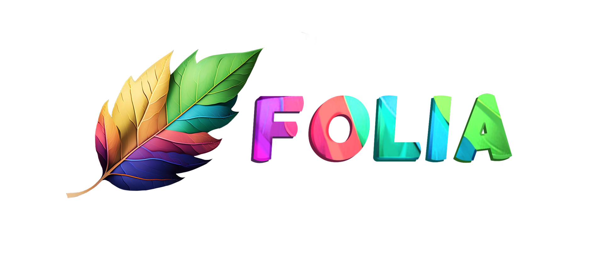

# FuckTick

<div align="center">
    
    <br><br>
    <strong>An experimental downstream fork of Folia.</strong>
    <br>
    Paper -> Folia -> FuckTick. That is the stack. Please do not mentally skip the Folia layer.
</div>

## What This Is

FuckTick is a personal experimental fork of [Folia](https://github.com/PaperMC/Folia). Folia is the upstream runtime model, and FuckTick layers additional experiments on top of it.

This repository is not Folia, is not PaperMC, and is not a place to report Folia bugs. Folia is upstreamed into FuckTick, not the other way around by default. If something only happens here, it is a FuckTick problem until proven otherwise.

The goal is to explore what happens when a Folia-style server goes further than regionized ticking:

- plugin-owned execution on dedicated plugin threads;
- stricter runtime diagnostics for plugin callbacks, queues, timeouts, and lifecycle state;
- conservative routing between plugin code and Folia owner contexts;
- internal compute workers for bounded server-owned CPU work;
- future per-player threading experiments;
- more aggressive detection of unsafe cross-context access.

Yes, the name is stupid. The threading model is not supposed to be.

## Current Experiment

The first major experiment is the FuckTick plugin runtime. Instead of throwing plugin callbacks into random async pools or pretending Folia has a single old-school main thread, FuckTick gives every plugin a controlled runtime and a dedicated worker thread:

```text
PluginFUCKLOADER
        |
        +-- FuckTick Plugin Thread - LuckPerms
        +-- FuckTick Plugin Thread - ProtocolLib
        +-- FuckTick Plugin Thread - GrimAC
        +-- ...
```

The important rule is still Folia's rule:

```text
plugin thread computes
owner thread mutates world/entity/region state
```

FuckTick does not make Bukkit, Paper, or Folia APIs magically thread-safe. It isolates plugin-owned execution and then routes owner-bound work back to the correct Folia context.

Read the runtime design here:

- [Plugin runtime design](docs/fucktick-plugin-runtime.md)
- [Compute broker design](docs/fucktick-compute-broker.md)
- [SMP plugin stack](docs/smp-plugin-stack.md)
- [Project description](PROJECT_DESCRIPTION.md)
- [Region logic notes](REGION_LOGIC.md)

## Compatibility

FuckTick is experimental and can be incompatible with plugins that already support Folia.

That sounds annoying because it is. Folia compatibility means the plugin understands regionized execution and Folia schedulers. FuckTick adds another runtime boundary for plugin-owned work, lifecycle, command execution, tab completion, async scheduler behavior, diagnostics, and future experiments. A plugin can be correct on Folia and still trip over a FuckTick edge case.

The project is tested on my SMP server. That environment runs a 30+ Folia-supported plugin stack, and the local `run/plugins` test stack currently visible in this workspace includes LuckPerms, ProtocolLib, GrimAC, ViaVersion, ViaBackwards, SkinsRestorer, TAB, CoreProtect, PlaceholderAPI, Simple Voice Chat, and more. The table is documented in [docs/smp-plugin-stack.md](docs/smp-plugin-stack.md).

This is not a certification program. It is a real server stack that keeps me honest while the runtime changes under it. Very professional. Very "why am I debugging plugin lifecycle at 03:00 again".

## Relationship With Folia

Folia remains the authoritative upstream execution model for this repository.

FuckTick inherits Folia's regionized ticking model, schedulers, and ownership rules. When upstream changes land in Folia, they can be pulled into FuckTick through the patch workflow. FuckTick-specific experiments should not be treated as Folia behavior, Folia promises, or PaperMC support obligations.

Short version:

- report Folia bugs to Folia only if they reproduce on clean Folia;
- report FuckTick bugs here if they require FuckTick patches;
- do not ask PaperMC to support FuckTick's plugin-thread experiments;
- do not assume a legacy global main thread exists.

## Roadmap

The plugin runtime is only the first step. The broader direction is:

- finish the compute -> effect -> owner-apply model for events and commands;
- expand Compute Broker call-site coverage for pathfinding, serialization, diagnostics, and rendering work where the snapshot/apply boundary is clear;
- expand conservative event routing without creating a giant switch-case graveyard;
- make diagnostics useful enough that server owners can tell which plugin is blocking what;
- move more plugin-owned async work into predictable per-plugin execution;
- experiment with per-player execution domains;
- keep upstream Folia behavior importable instead of turning the fork into an unmergeable pile.

The roadmap is intentionally uncomfortable. If this were only a rebrand, there would be no point.

## Building

This repository uses the paperweight patch workflow. The effective source stack is:

```text
Paper -> Folia -> FuckTick
```

Readable generated source trees such as `paper-*` and `folia-*` are upstream or generated workspace output. FuckTick-owned work belongs in `fucktick-api` and `fucktick-server`, and final changes should be represented as patch files.

Typical local flow:

```bash
./gradlew applyAllPatches
./gradlew rebuildPaperPatches
./gradlew fucktick-server:rebuildServerPatches
./gradlew fucktick-server:rebuildMinecraftPatches
```

On Windows, use the matching `*.bat` wrappers if they are the active workflow for your checkout.

## Release Channels

GitHub Actions reads the final non-empty line of the commit message and uses it as the CI/release policy. If no marker is present, the workflow runs a verification build but does not publish a release.

| Marker | Action | Release type |
| --- | --- | --- |
| `- ci ignore` | Skip the expensive build and publish nothing. | None |
| `- ci risk` | Build and publish a high-risk test artifact. | Prerelease |
| `- ci beta` | Build and publish a beta-quality artifact. | Prerelease |
| `- ci stable` | Build and publish a stable release. | Latest release |

Use the most conservative marker that honestly describes the change. Stable releases should be reserved for builds that are intended to be used as the normal update path, not just builds that happen to compile.

## Support This Mess

I am not asking for money. I am not selling a magical "make all plugins async-safe" pill. A GitHub star helps the project get seen, and a real bug report with logs helps more than ten vague "doesn't work" messages.

If you want the human side of development, subscribe to my Telegram channel: [t.me/devfolia](https://t.me/devfolia). I will post development notes, cursed profiling screenshots, and probably the occasional 03:00 message about being sad because my ex left. Enterprise-grade emotional observability.

Stars (mb telegram stars...?) are welcome. Pull requests are better. Thread dumps are love letters.

## License

FuckTick is built as a downstream fork using the Paper/Folia patch workflow. Upstream projects keep their own licenses. FuckTick patches are covered by the patch license files in this repository.
